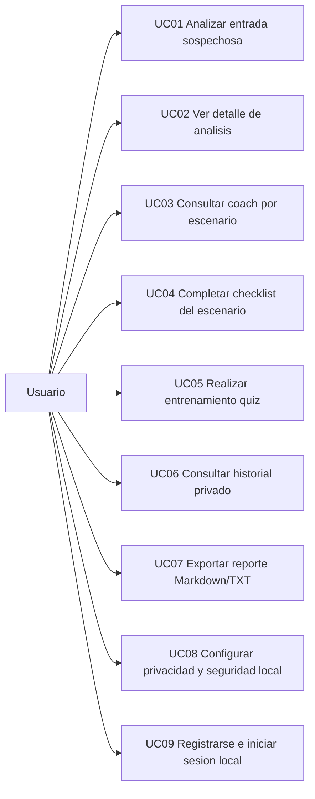

# Casos de Uso (MVP A)

## Diagrama (Mermaid)

## UC01 - Analizar entrada sospechosa (texto o captura OCR)
- Actor principal: Usuario
- Disparador: El usuario quiere evaluar un SMS/email/chat/enlace.
- Precondiciones:
1. Sesion local activa.
2. App abierta en pantalla Analizar.
3. Motor heuristico local disponible.
- Flujo principal:
1. El usuario introduce texto/enlace y selecciona origen (SMS/WhatsApp/Email/Otro).
2. Pulsa "Analizar ahora".
3. El sistema ejecuta reglas explicables, calcula score (0-100) y semaforo.
4. El sistema muestra texto resaltado, lectura rapida, desglose del enlace, senales, recomendaciones y plan de accion.
5. Si privacidad extrema esta desactivada, se guardan solo metadatos en Room.
- Flujos alternativos:
1. A1 - Entrada vacia:
   El sistema bloquea analisis y muestra error de validacion.
2. A2 - Analisis desde captura OCR:
   El usuario pulsa "Analizar desde captura", selecciona imagen, se ejecuta OCR local y se abre revision editable antes de analizar.
3. A3 - OCR sin texto o error OCR:
   El sistema informa error y no persiste datos.
4. A4 - Privacidad extrema activa:
   Se muestra resultado pero no se persiste incidente.
5. A5 - Entrada compartida desde otra app:
   La app recibe `ACTION_SEND`, conserva el contenido y, tras autenticar si hace falta, abre Analizar con el texto precargado.
- Postcondiciones:
1. Siempre hay resultado visible o mensaje de error controlado.
2. Nunca se guarda texto original ni imagen OCR.
3. Solo en modo normal se persisten metadatos.

## UC02 - Ver detalle de analisis
- Actor principal: Usuario
- Disparador: El usuario abre un analisis guardado.
- Precondiciones:
1. Existe `incidentId` valido (SafeArgs).
2. Datos de incidente disponibles en Room.
- Flujo principal:
1. El usuario abre detalle desde Analizar o Historial.
2. El sistema carga `Incident + AnalysisResult + Signals`.
3. Muestra score, semaforo, fuente, dominio sanitizado, senales, recomendaciones y plan de accion.
4. Opcionalmente navega a `Recursos oficiales`.
- Flujos alternativos:
1. A1 - `incidentId` inexistente:
   El sistema muestra estado de "analisis no encontrado".
- Postcondiciones:
1. El detalle queda consultado sin modificar datos.

## UC03 - Consultar coach por escenario
- Actor principal: Usuario
- Disparador: El usuario entra en Coach.
- Precondiciones:
1. Archivo `assets/coach_scenarios.json` disponible.
2. Sesion local activa.
- Flujo principal:
1. El sistema carga escenarios desde assets.
2. Muestra lista de escenarios con descripcion.
3. El usuario selecciona uno para abrir checklist.
- Flujos alternativos:
1. A1 - Seed vacia o invalida:
   Se muestra estado vacio con mensaje informativo.
- Postcondiciones:
1. Escenarios visibles para navegacion a checklist.

## UC04 - Completar checklist del escenario
- Actor principal: Usuario
- Disparador: El usuario abre checklist de un escenario.
- Precondiciones:
1. `scenarioId` valido.
- Flujo principal:
1. El sistema muestra items del checklist.
2. El usuario marca/desmarca pasos.
3. El sistema actualiza contador de progreso en pantalla.
- Flujos alternativos:
1. A1 - `scenarioId` no encontrado:
   Se muestra estado vacio.
- Postcondiciones:
1. Checklist completado en sesion (no persistencia en MVP A).

## UC05 - Realizar entrenamiento quiz
- Actor principal: Usuario
- Disparador: El usuario inicia entrenamiento.
- Precondiciones:
1. Archivo `assets/training_questions.json` valido.
2. Sesion local activa.
- Flujo principal:
1. El sistema carga preguntas locales con nivel y categoria.
2. El usuario selecciona un nivel (`Principiante`, `Intermedio` o `Avanzado`).
3. El sistema filtra y prepara solo las preguntas de ese nivel.
4. Muestra pregunta actual.
5. El usuario selecciona respuesta y recibe feedback con explicacion.
6. Repite hasta finalizar.
7. El sistema muestra resultado final (nivel, aciertos, porcentaje y mensaje adaptado).
- Flujos alternativos:
1. A1 - Usuario intenta continuar sin responder:
   El sistema solicita seleccionar opcion.
2. A2 - Seed invalida:
   Se muestra error/estado vacio.
3. A3 - Nivel sin preguntas disponibles:
   El sistema mantiene deshabilitado el boton de inicio.
- Postcondiciones:
1. Resultado final calculado sin persistir datos personales.

## UC06 - Consultar historial privado
- Actor principal: Usuario
- Disparador: El usuario abre Historial.
- Precondiciones:
1. Sesion local activa.
2. Si bloqueo local esta activo, biometria/credencial disponible.
- Flujo principal:
1. El sistema solicita autenticacion local cuando aplica.
2. Tras autenticar, lista incidentes con score/semaforo/fecha/origen.
3. El usuario abre un item para revisar detalle.
- Flujos alternativos:
1. A1 - Usuario cancela autenticacion:
   Se deniega acceso y se vuelve atras.
2. A2 - Historial vacio:
   Se muestra mensaje "sin analisis guardados".
- Postcondiciones:
1. Datos protegidos solo visibles tras autenticacion cuando bloqueo esta activo.

## UC07 - Exportar reporte Markdown/TXT
- Actor principal: Usuario
- Disparador: El usuario decide compartir evidencia del analisis.
- Precondiciones:
1. Detalle cargado correctamente.
- Flujo principal:
1. El usuario pulsa "Exportar Markdown".
2. El sistema genera reporte local con metadatos/senales/recomendaciones.
3. Se abre chooser para compartir.
- Flujos alternativos:
1. A1 - No hay app destino:
   Se informa al usuario que no hay manejador disponible.
- Postcondiciones:
1. Reporte exportado por accion explicita del usuario.
2. El reporte no incluye texto original analizado.

## UC08 - Configurar privacidad y seguridad local
- Actor principal: Usuario
- Disparador: El usuario abre Ajustes.
- Precondiciones:
1. Pantalla Ajustes accesible.
2. Si bloqueo local esta activo, autenticacion local correcta.
- Flujo principal:
1. Activar/desactivar privacidad extrema.
2. Activar/desactivar bloqueo local (Historial/Ajustes).
3. Guardar flags locales cifrados.
4. Ejecutar `Borrar datos locales`.
5. Consultar cuenta local activa y cerrar sesion si procede.
- Flujos alternativos:
1. A1 - Cancelacion de autenticacion al entrar en Ajustes:
   Se cierra pantalla protegida.
- Postcondiciones:
1. Con privacidad extrema activa, nuevos analisis no se persisten.
2. Con bloqueo local activo, Historial y Ajustes quedan protegidos.
3. El cierre de sesion obliga a reautenticar para volver a entrar en la app.

## UC09 - Registrarse e iniciar sesion local
- Actor principal: Usuario
- Disparador: El usuario abre la app sin sesion activa o decide cerrar sesion.
- Precondiciones:
1. App instalada en el dispositivo.
2. Almacenamiento local disponible.
- Flujo principal:
1. El sistema muestra `Login` cuando no existe sesion local.
2. Si el usuario no tiene cuenta, pulsa `Crear cuenta local`.
3. Introduce nombre, correo y contrasena.
4. El sistema valida formato y coincidencia de contrasenas.
5. Se crea el usuario en Room y se guarda la sesion local cifrada.
6. El usuario entra en Home o en Analizar si habia contenido compartido pendiente.
7. Desde Ajustes puede cerrar sesion.
- Flujos alternativos:
1. A1 - Correo duplicado:
   El sistema informa que ya existe una cuenta local con ese correo.
2. A2 - Credenciales incorrectas:
   El sistema muestra error y no abre la aplicacion.
3. A3 - Campos invalidos:
   El sistema marca errores de validacion en nombre, correo o contrasena.
- Postcondiciones:
1. Existe una sesion local activa mientras el usuario no cierre sesion.
2. La autenticacion no depende de red ni backend.
