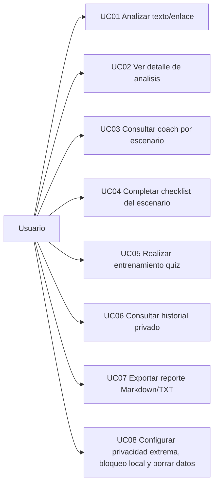

# Casos de Uso (MVP A)

## Diagrama (Mermaid)

## UC01 - Analizar texto/enlace
- Actor: Usuario
- Precondiciones: App abierta; entrada no vacia.
- Flujo principal:
1. El usuario abre pantalla Analizar.
2. Introduce texto/enlace y origen.
3. Pulsa "Analizar ahora".
4. El sistema aplica heuristicas explicables y calcula score/semaforo.
5. Muestra senales y recomendaciones.
6. Si privacidad extrema esta desactivada, guarda metadatos.
- Postcondiciones: resultado visible en pantalla.

## UC02 - Ver detalle de analisis
- Actor: Usuario
- Precondiciones: existe `incidentId` guardado.
- Flujo principal:
1. El usuario abre detalle desde Analizar o Historial.
2. El sistema carga incidente, resultado y senales desde Room.
3. Muestra score, semaforo, fuente, dominio sanitizado, senales y recomendaciones.
- Postcondiciones: detalle consultado.

## UC03 - Consultar coach por escenario
- Actor: Usuario
- Precondiciones: seed local de escenarios disponible.
- Flujo principal:
1. El usuario abre pantalla Coach.
2. El sistema carga escenarios desde `assets/coach_scenarios.json`.
3. Muestra lista de escenarios.
- Postcondiciones: escenarios listados.

## UC04 - Completar checklist del escenario
- Actor: Usuario
- Precondiciones: escenario seleccionado.
- Flujo principal:
1. El usuario abre checklist de un escenario.
2. Marca/desmarca items.
3. El sistema actualiza contador de progreso.
- Postcondiciones: checklist completado en sesion actual.

## UC05 - Realizar entrenamiento quiz
- Actor: Usuario
- Precondiciones: seed local de preguntas disponible.
- Flujo principal:
1. El usuario inicia entrenamiento.
2. El sistema carga preguntas desde `assets/training_questions.json`.
3. Presenta pregunta y opciones.
4. El usuario responde y recibe feedback inmediato.
5. Avanza hasta mostrar resultado final (aciertos y porcentaje).
- Postcondiciones: entrenamiento finalizado con feedback.

## UC06 - Consultar historial privado
- Actor: Usuario
- Precondiciones: existen analisis guardados.
- Flujo principal:
1. El usuario abre Historial.
2. El sistema lista incidentes con score/semaforo/fecha/origen.
3. El usuario abre un item y consulta detalle.
- Postcondiciones: historial y detalle consultados.

## UC07 - Exportar reporte Markdown/TXT
- Actor: Usuario
- Precondiciones: detalle de analisis cargado.
- Flujo principal:
1. El usuario pulsa "Exportar Markdown".
2. El sistema genera reporte local.
3. Abre chooser Android para compartir.
- Postcondiciones: reporte compartido manualmente.

## UC08 - Configurar privacidad extrema, bloqueo local y borrar datos
- Actor: Usuario
- Precondiciones: pantalla Ajustes accesible.
- Flujo principal:
1. El usuario activa/desactiva privacidad extrema.
2. El usuario puede activar/desactivar bloqueo local para Historial y Ajustes.
3. El sistema guarda flags cifrados localmente.
4. El usuario puede pulsar "Borrar datos locales".
5. El sistema elimina historial y resultados de Room.
- Postcondiciones:
1. Con privacidad extrema activa, no se persisten nuevos analisis.
2. Con bloqueo local activo, Historial y Ajustes requieren autenticacion biometrica/credencial.
3. Datos previos eliminados si se ejecuta borrado.
