# Diagrama de Clases (vista simplificada)

## Diagrama (Mermaid)

```mermaid
classDiagram
    class AuthGateFragment
    class AuthGateViewModel
    class LoginFragment
    class LoginViewModel
    class RegisterFragment
    class RegisterViewModel
    class LoginLocalUserUseCase
    class RegisterLocalUserUseCase
    class ObserveCurrentUserUseCase
    class LogoutCurrentUserUseCase
    class AuthRepository
    class AuthRepositoryImpl
    class UserDao
    class UserEntity
    class AnalyzeFragment
    class AnalyzeViewModel
    class AnalyzeAndPersistUseCase
    class AnalyzeInputUseCase
    class RuleEngine
    class IncidentRepository
    class IncidentRepositoryImpl
    class IncidentDao
    class AppDatabase
    class SettingsRepository
    class SettingsRepositoryImpl
    class SecureSettingsDataSource
    class CoachFragment
    class CoachViewModel
    class GetCoachScenariosUseCase
    class CoachRepository
    class CoachRepositoryImpl
    class SeedAssetLoader
    class SeedJsonParser
    class TrainingViewModel
    class GetTrainingQuestionsUseCase
    class TrainingRepository
    class TrainingRepositoryImpl
    class TrainingLevel
    class TrainingQuestion
    class QuizEngine
    class AnalysisDetailFragment
    class IncidentDetailViewModel
    class ObserveIncidentDetailUseCase
    class HistoryFragment
    class HistoryViewModel
    class ObserveHistoryUseCase

    AuthGateFragment --> AuthGateViewModel
    AuthGateViewModel --> ObserveCurrentUserUseCase
    ObserveCurrentUserUseCase --> AuthRepository
    LoginFragment --> LoginViewModel
    LoginViewModel --> LoginLocalUserUseCase
    LoginLocalUserUseCase --> AuthRepository
    RegisterFragment --> RegisterViewModel
    RegisterViewModel --> RegisterLocalUserUseCase
    RegisterLocalUserUseCase --> AuthRepository
    AuthRepository <|.. AuthRepositoryImpl
    AuthRepositoryImpl --> UserDao
    AuthRepositoryImpl --> SecureSettingsDataSource
    UserDao --> UserEntity

    AnalyzeFragment --> AnalyzeViewModel
    AnalyzeViewModel --> AnalyzeAndPersistUseCase
    AnalyzeAndPersistUseCase --> AnalyzeInputUseCase
    AnalyzeInputUseCase --> RuleEngine
    AnalyzeAndPersistUseCase --> IncidentRepository
    AnalyzeAndPersistUseCase --> SettingsRepository
    IncidentRepository <|.. IncidentRepositoryImpl
    IncidentRepositoryImpl --> IncidentDao
    IncidentRepositoryImpl --> AppDatabase
    SettingsRepository <|.. SettingsRepositoryImpl
    SettingsRepositoryImpl --> SecureSettingsDataSource

    CoachFragment --> CoachViewModel
    CoachViewModel --> GetCoachScenariosUseCase
    GetCoachScenariosUseCase --> CoachRepository
    CoachRepository <|.. CoachRepositoryImpl
    CoachRepositoryImpl --> SeedAssetLoader
    SeedAssetLoader --> SeedJsonParser

    TrainingViewModel --> GetTrainingQuestionsUseCase
    GetTrainingQuestionsUseCase --> TrainingRepository
    TrainingRepository <|.. TrainingRepositoryImpl
    TrainingRepositoryImpl --> SeedAssetLoader
    TrainingViewModel --> TrainingLevel
    TrainingRepositoryImpl --> TrainingQuestion
    TrainingViewModel --> QuizEngine

    AnalysisDetailFragment --> IncidentDetailViewModel
    IncidentDetailViewModel --> ObserveIncidentDetailUseCase
    ObserveIncidentDetailUseCase --> IncidentRepository

    HistoryFragment --> HistoryViewModel
    HistoryViewModel --> ObserveHistoryUseCase
    ObserveHistoryUseCase --> IncidentRepository
```

## Notas de arquitectura
- `presentation`: Fragments + ViewModels (`StateFlow`) para estado UI.
- `presentation/auth`: gate de sesion, login y registro local.
- `domain`: use cases y motor heuristico/quiz (logica testeable).
- `data`: repositorios, Room y seed local desde `assets`.
- Separacion MVVM mantenida: `UI -> ViewModel -> UseCase -> Repository -> Fuente de datos`.
