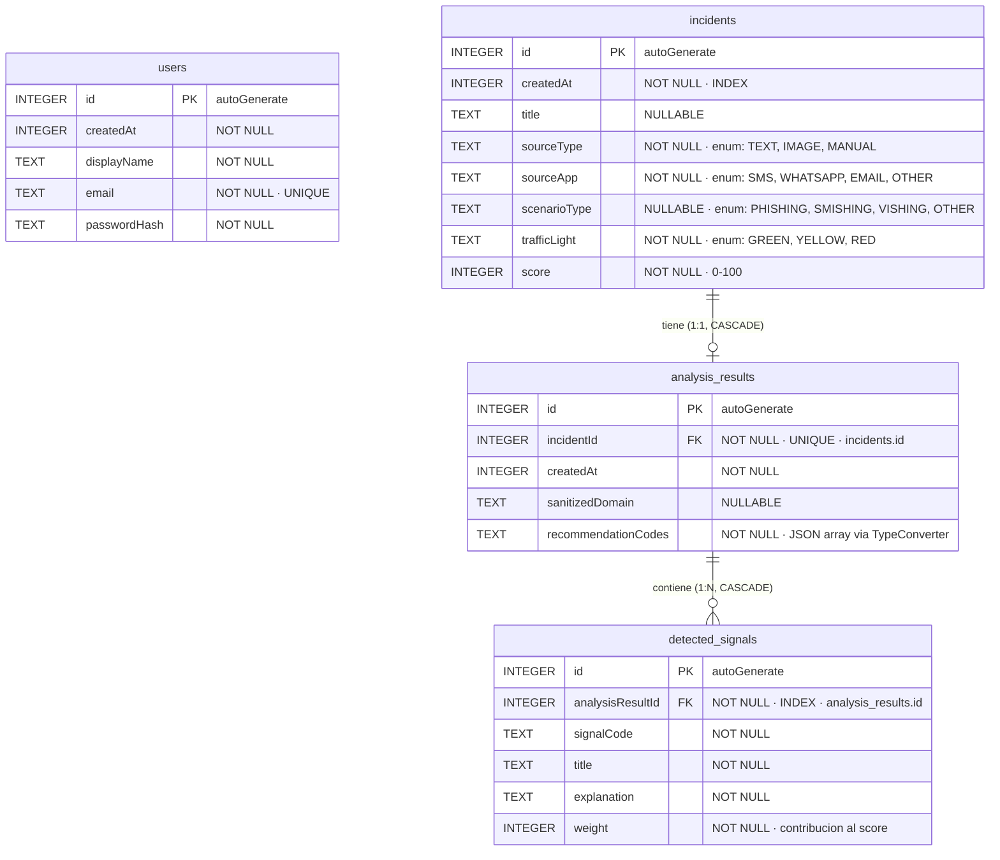

# Modelo Entidad-Relacion - AntiPhishingCoach

Base de datos local Room: `antiphishing_coach.db` · Version de esquema: 2

---

## Diagrama E/R



---

## Tablas

### `users`

Almacena la cuenta local necesaria para acceder a la aplicacion sin backend.

| Columna        | Tipo SQLite | Restriccion       | Descripcion |
|----------------|-------------|------------------|-------------|
| `id`           | INTEGER     | PK, autoGenerate | Identificador unico |
| `createdAt`    | INTEGER     | NOT NULL         | Timestamp de alta local |
| `displayName`  | TEXT        | NOT NULL         | Nombre visible del usuario |
| `email`        | TEXT        | NOT NULL, UNIQUE | Correo usado para login local |
| `passwordHash` | TEXT        | NOT NULL         | Hash SHA-256 de la contrasena |

Notas:
- La contrasena no se almacena en texto plano.
- La sesion activa no se guarda en esta tabla, sino en preferencias cifradas.

---

### `incidents`

Almacena los **metadatos** del incidente analizado.
El texto original introducido por el usuario **no se persiste** (privacidad por diseno).

| Columna        | Tipo SQLite | Restriccion           | Descripcion |
|----------------|-------------|----------------------|-------------|
| `id`           | INTEGER     | PK, autoGenerate     | Identificador unico |
| `createdAt`    | INTEGER     | NOT NULL, INDEX      | Timestamp Unix en milisegundos |
| `title`        | TEXT        | NULLABLE             | Titulo inferido (dominio, asunto...) |
| `sourceType`   | TEXT        | NOT NULL             | Origen del texto: `TEXT`, `IMAGE`, `MANUAL` |
| `sourceApp`    | TEXT        | NOT NULL             | App de origen: `SMS`, `WHATSAPP`, `EMAIL`, `OTHER` |
| `scenarioType` | TEXT        | NULLABLE             | Tipo de amenaza: `PHISHING`, `SMISHING`, `VISHING`, `OTHER` |
| `trafficLight` | TEXT        | NOT NULL             | Resultado semaforo: `GREEN`, `YELLOW`, `RED` |
| `score`        | INTEGER     | NOT NULL             | Puntuacion de riesgo agregada (0-100) |

**Indice:** `createdAt` (para ordenar el historial sin full-scan).

---

### `analysis_results`

Resultado **agregado** del analisis. Relacion 1:1 con `incidents`
(indice `UNIQUE` sobre `incidentId`).

| Columna                | Tipo SQLite | Restriccion                          | Descripcion |
|------------------------|-------------|--------------------------------------|-------------|
| `id`                   | INTEGER     | PK, autoGenerate                     | Identificador unico |
| `incidentId`           | INTEGER     | FK incidents.id, UNIQUE, NOT NULL    | Incidente asociado |
| `createdAt`            | INTEGER     | NOT NULL                             | Timestamp del analisis |
| `sanitizedDomain`      | TEXT        | NULLABLE                             | Dominio normalizado extraido del texto |
| `recommendationCodes`  | TEXT        | NOT NULL                             | JSON array de codigos de recomendacion |

**Clave foranea:** `onDelete = CASCADE` - al eliminar el incidente se elimina su resultado.

---

### `detected_signals`

Senales **individuales** detectadas por el motor de reglas.
Cada senal corresponde a una regla heuristica disparada durante el analisis.

| Columna             | Tipo SQLite | Restriccion                                  | Descripcion |
|---------------------|-------------|----------------------------------------------|-------------|
| `id`                | INTEGER     | PK, autoGenerate                             | Identificador unico |
| `analysisResultId`  | INTEGER     | FK analysis_results.id, INDEX, NOT NULL      | Resultado al que pertenece |
| `signalCode`        | TEXT        | NOT NULL                                     | Codigo de la regla (p.ej. `IDN_HOMOGLYPH`) |
| `title`             | TEXT        | NOT NULL                                     | Titulo legible de la senal |
| `explanation`       | TEXT        | NOT NULL                                     | Explicacion en lenguaje natural |
| `weight`            | INTEGER     | NOT NULL                                     | Peso de la senal en el score final |

**Clave foranea:** `onDelete = CASCADE` - al eliminar el resultado se eliminan sus senales.

---

## Relaciones

```
users (0..N)  // tabla independiente de identidad local
incidents (1) --------------- (0..1) analysis_results (1) --------------- (0..N) detected_signals
            onDelete=CASCADE                          onDelete=CASCADE
```

- Un usuario local puede existir sin incidentes asociados.
- Un incidente tiene **como maximo un** resultado de analisis (UNIQUE sobre `incidentId`).
- Un resultado puede tener **cero o mas** senales detectadas.
- El borrado en cascada garantiza que `DELETE FROM incidents` elimina todos los datos asociados sin queries adicionales. Lo usa `ClearLocalDataUseCase`.

---

## Relaciones Room (data classes)

```kotlin
// Resultado con sus senales
data class AnalysisResultWithSignals(
    @Embedded val analysisResult: AnalysisResultEntity,
    @Relation(parentColumn = "id", entityColumn = "analysisResultId")
    val signals: List<DetectedSignalEntity>
)

// Incidente completo con resultado y senales
data class IncidentWithAnalysisAndSignals(
    @Embedded val incident: IncidentEntity,
    @Relation(entity = AnalysisResultEntity::class,
              parentColumn = "id", entityColumn = "incidentId")
    val result: AnalysisResultWithSignals?
)
```

Room materializa estas relaciones mediante `@Transaction` para garantizar consistencia cuando una lectura logica requiere multiples queries SQL internas.

---

## TypeConverter: `StringListConverter`

`recommendationCodes` en `analysis_results` almacena una `List<String>` serializada como JSON mediante Gson:

```
["REC_VERIFY_SENDER", "REC_CHECK_LINKS", "REC_DO_NOT_CLICK"]
```

SQLite no tiene tipo array nativo. Se eligio JSON sobre columnas separadas porque el numero de recomendaciones por analisis es variable (0-N) y las recomendaciones se leen siempre juntas, nunca de forma individual.

---

## Decisiones de diseno

| Decision | Alternativa descartada | Motivo |
|----------|------------------------|--------|
| Tabla `users` separada | Guardar sesion y credenciales solo en preferencias | Permite mantener trazabilidad en Room y separar identidad de estado de sesion |
| Hash de contrasena en `users` | Contrasena en texto plano | Minimiza exposicion accidental de credenciales locales |
| Texto original no persistido | Guardar el texto analizado | Privacidad por diseno: el usuario no deja rastro del contenido analizado |
| 3 tablas relacionadas de analisis | Tabla unica con columnas JSON | Las senales son consultables individualmente; una tabla plana lo impediria |
| `fallbackToDestructiveMigration` | Migraciones explicitas | Proyecto academico sin datos productivos que preservar |
| `exportSchema = true` | Sin exportacion | Permite rastrear cambios de esquema y preparar migraciones futuras |
| `onDelete = CASCADE` | Borrado manual multicapa | Simplifica `ClearLocalDataUseCase` a una sola operacion |
| Score numerico (0-100) en `incidents` | Solo semaforo | Permite ordenar y filtrar por riesgo cuantitativo ademas de por color |
