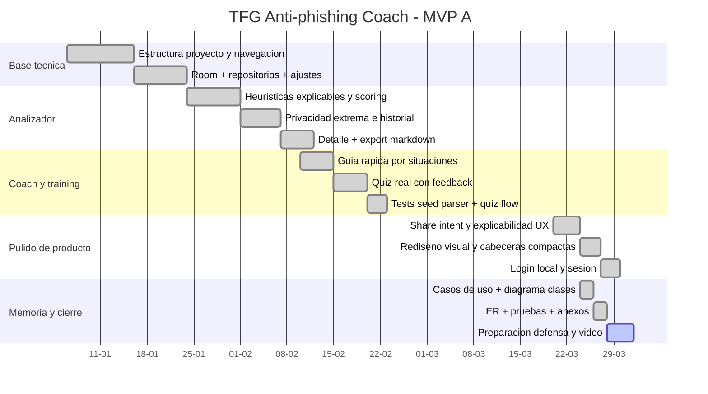

# Planificacion Gantt (MVP A)

## Plan por fases
| Fase | Objetivo | Semanas | Estado |
|---|---|---|---|
| F1 | Base proyecto (Gradle, navegacion, Room, estructura capas) | S1-S2 | Completada |
| F2 | Analizador heuristico + privacidad extrema + historial minimo | S3-S4 | Completada |
| F3 | Detalle de analisis + exportacion Markdown/TXT | S5 | Completada |
| F4 | Guia rapida por situaciones (seed + detalle guiado) | S6 | Completada |
| F5 | Training quiz (seed + feedback + resultado) | S6-S7 | Completada |
| F6 | Pulido UX real (share intent, explicabilidad, acciones guiadas) | S8 | Completada |
| F7 | Login local + cierre de sesion + documentacion final | S8-S9 | Completada |

## Gantt (Mermaid)

## Evidencia de pruebas ejecutadas (cierre tecnico 2026-04-07)
- Build debug:
1. `.\gradlew.bat :app:assembleDebug` -> `BUILD SUCCESSFUL`
- Unit tests:
1. `.\gradlew.bat :app:testDebugUnitTest` -> `BUILD SUCCESSFUL` (`125/125`)
- Lint:
1. `.\gradlew.bat :app:lintDebug` -> `BUILD SUCCESSFUL` (`0 errores`)
- Instalacion emulador/dispositivo:
1. `.\gradlew.bat :app:installDebug` -> `FAIL` por entorno (`No connected devices!`)
- Verificaciones funcionales recientes:
1. share intent a `Analizar`
2. resaltado de frases sospechosas y plan de accion
3. login local, registro y cierre de sesion
4. OCR local con revision editable previa
5. dashboard Home e historial con filtros/orden
- Pendientes manuales por entorno:
1. PF-12 `Borrar datos`
2. PF-22 `Cancelacion de autenticacion`
3. PF-24 `OCR con imagen borrosa`
